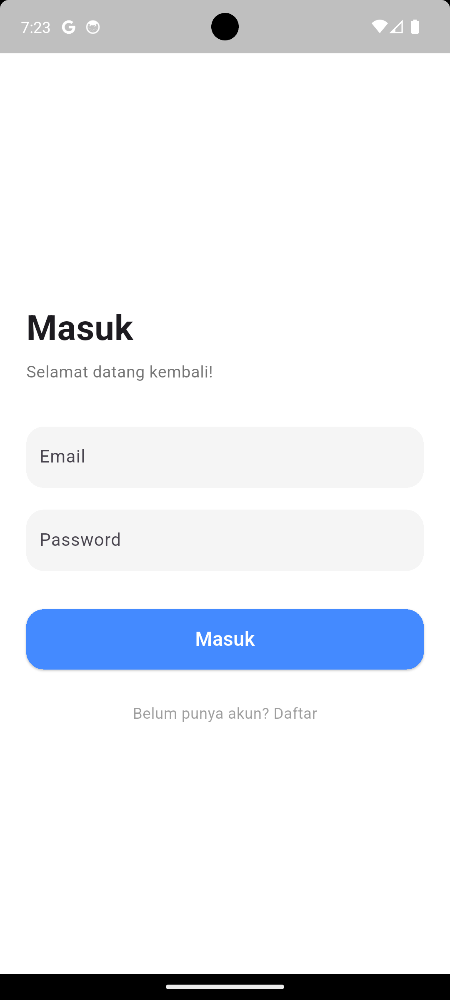

# Simple Marketplace App

Nama: Ferdy Apriliyanto
Flutter Version: 3.29.3
Cara menjalankan project: menggunakan CLI di root project dengan command 'flutter run'

## Screenshot Tampilan Login

## Screenshot Tampilan Home

